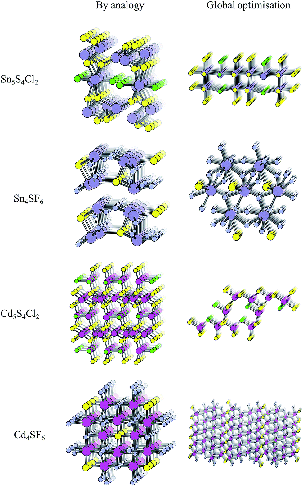

In this study we use compositional screening, along with techniques based on structural analogy and global searches (evolutionary algorithms) to identify new three-component semiconductors with band gaps appropriate for photoelectrochemical water splitting. 

[Download paper here](http://dandavies99.github.io/files/2018_chemsci.pdf)

