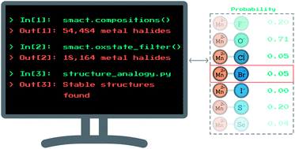

[Faraday Discussions](https://www.rsc.org/journals-books-databases/about-journals/faraday-discussions/) are a unique format of meeting whereby authors present an overview of a pre-submitted paper and a general discussion follows that is recorded and published alongside the original work. We presented work on evaluating the likelihood that transition metals adopt specific oxidation states based on the anions present in the material. This was done following a statistical approach based on known oxidation states in the ICSD. We then use this information predictively to suggest a range of novel ternary metal halide compounds.

[Download paper here](http://dandavies99.github.io/files/2018_faradaydiscuss2.pdf)

