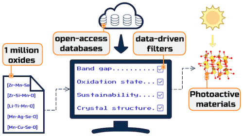

In this work we use a series of cheap, data-driven filters to screen through a million possible quaternary oxides to identify new photoactive semiconductors. This includes a supervised learning model to predict band gap, trained on a pre-existing database of accurately calculated values. 

[Download paper here](http://dandavies99.github.io/files/2019_chemmater.pdf)
