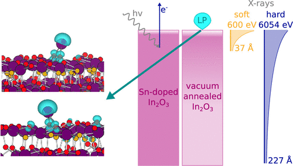

A joint experimental -- computational study in which indium 5s lone pairs are identified for the first time on the surface of indium oxide.

[Download paper here](http://dandavies99.github.io/files/2019_jpcc.pdf)j
