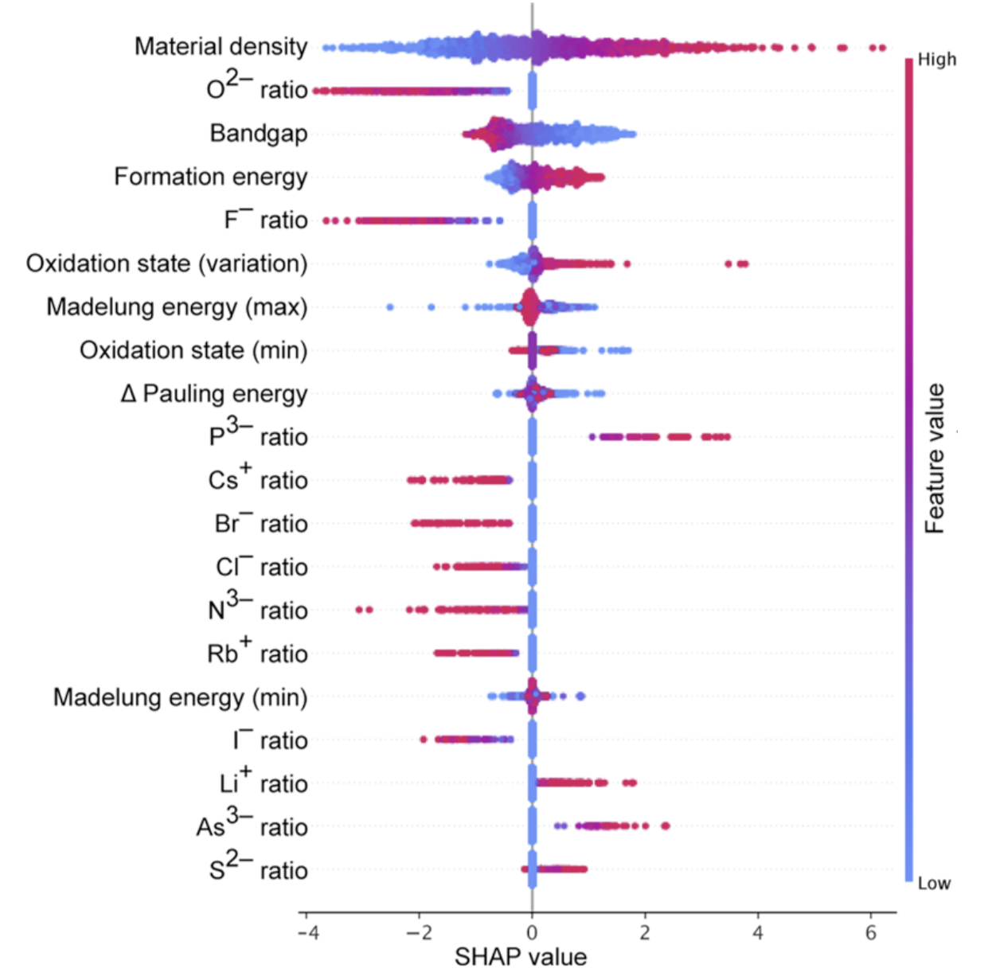

We apply two machine learning models (support vector regression and deep neural networks) to the challenge of predicting dielectric properties of inorganic materials. We also carry out analysis based on game theory to explain and interpret the built models. 

The code to reproduce the results in this paper is [available here](https://github.com/WMD-group/Dielectric_ML).

[Download paper here](http://dandavies99.github.io/files/2020_jcp.pdf)
