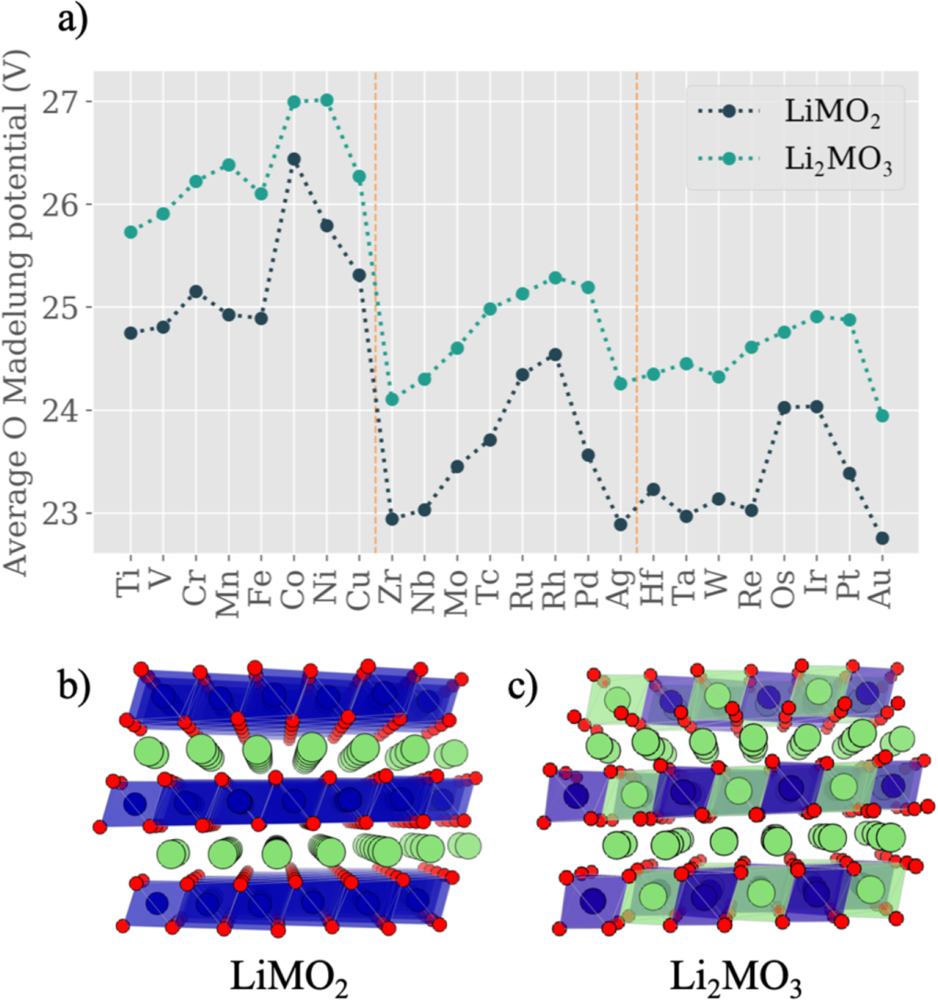

Enhanced battery capacities can be achieved if the anion in a cathode  contributes to reversible oxidation but the origins of redox activity in crystals are difficult to quantify.

In this study, we present practical procedures for using simple descriptors relating to the electrostatics (Madelung energy) and electronic structure (density of states) to help predict the redox activity of anions in inorganic compounds.

[Download paper here](http://dandavies99.github.io/files/2020_scinotes.pdf)
